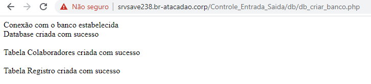
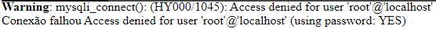

# Sistema de controle de entrada e saída
CRUD feito em PHP. HTML, CSS e JS puros para registrar entrada e saída de colaboradores em situações gerais.  
Mensagens e avisos no sistema estão configurados para controlar a ida e volta de ir lavar as mãos, mas pode ser adaptado para basicamente qualquer situação dentro do escopo.  
## Requisitos
* PHP 7
* MariaDB 5.5 (ou MySQL compatível)

## Como utilizar?
As credenciais do banco de dados são armazenadas em um arquivo json ***credenciais_banco.json***, localizado dentro da pasta ***db*** do projeto.  

Edite esse arquivo para o usuário e senha do seu banco de dados.

Abra no navegador o endereço do servidor onde está hospedado o sistema, acesse a página   
<code>Controle_Entrada_Saida/db/db_criar_banco.php</code>  
  
Em caso de sucesso, verá esta mensagem das tabelas e base de dados criadas com sucesso.   
A partir de agora, basta entrar na página Administração>Colaboradores e cadastrar com nome e número de identificação (matrícula)

# Recursos Futuros
* CSS melhorado para visual e organização de elementos
* Distinguir usuários por setor (ou outra característica que corresponda ao sua regra de negócio)
* Capitalização automática em nomes próprios no cadastro
* Alarme sonoro para usuário extrapolando prazos predefinidos
* Alerta por email pelo mesmo motivo acima.
* Importação de usuários ou registros a partir de CSV ou JSON
* Exportação em PDF e CSV

# FAQ
## Tento abrir o db_criar_banco.php e vejo o código fonte, não a mensagem de tabela criada.

O endereço acessado está incorreto. Dessa maneira, o navegador tenta abrir diretamente o arquivo de texto com o código PHP.
Para funcionar, esse código precisa ser interpretado pelo servidor PHP e depois exibido no navegador.  
Verifique o endereço do seu servidor PHP para acessar por lá, não pelo arquivo em si.  
## Warning: mysqli_connect(): (HY000/1045): Access denied for user 'root'@'localhost' (using password: YES) 

A senha no arquivo credenciais_banco.json está incorreta.

# Licença
Você pode copiar, alterar e distribuir este software, desde que mantenha os direitos autorais em todas as cópias e lance publicamente o código alterado da mesma maneira que este original está.